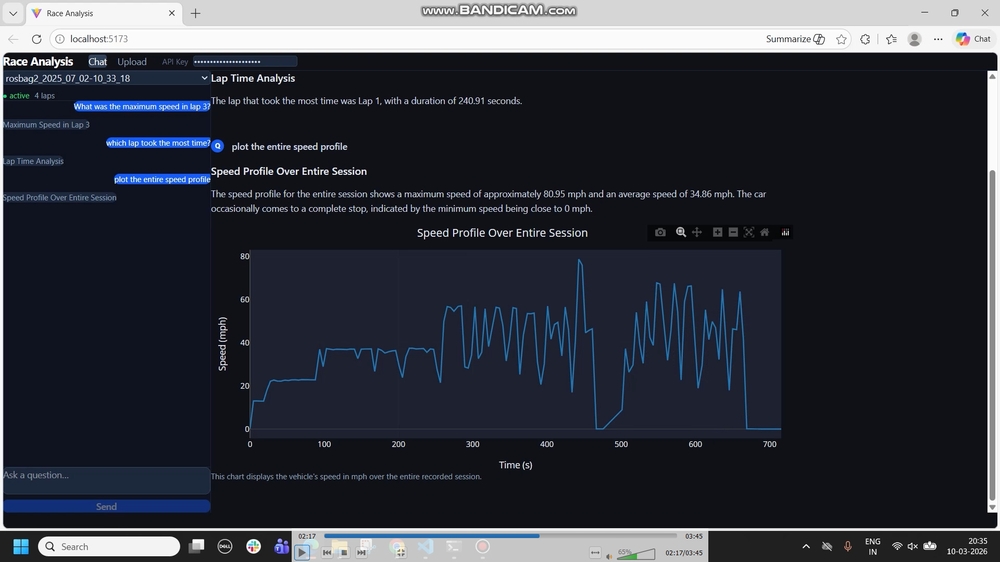
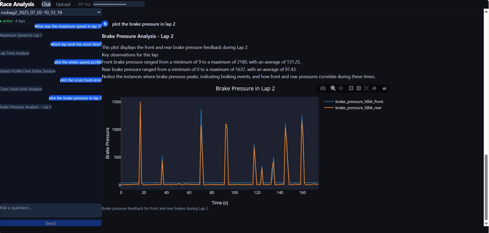
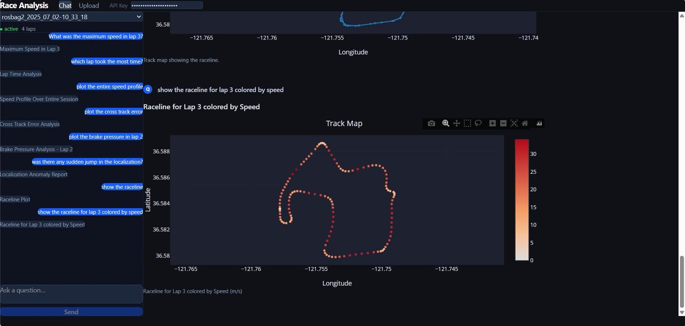
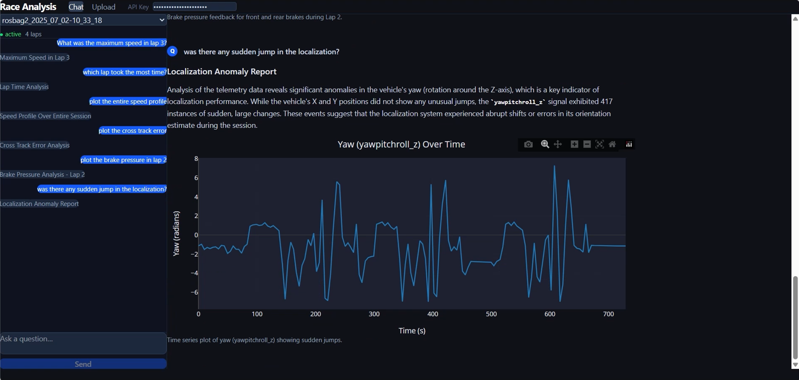

# Race Analysis Agents

AI powered telemetry analysis platform for autonomous racing data.

This system allows engineers to **upload race sessions, process multi-sensor telemetry and query driving performance using natural language.** The platform automatically generates **statistics, visualizations and insights** about vehicle behavior.



The application is containerized using **Docker** and deployed on **Google Cloud Run**.

**Web application:** [Race Analysis Web Application](https://race-analysis-410676170619.us-central1.run.app/)

*Access requires an API key. If you'd like to try the application, feel free to contact me at anooshkabajaj@gmail.com*

---

## Contents

- [Overview](#overview)
- [Features](#features)
  - [AI Telemetry Querying](#ai-telemetry-querying)
  - [Multi-Sensor Data Alignment](#multi-sensor-data-alignment)
  - [Track-Aware Analysis](#track-aware-analysis)
  - [Interactive Visualization](#interactive-visualization)
- [Tech Stack](#tech-stack)
- [Demo](#demo)
- [Quick Start](#quick-start)
- [Upload Requirements](#upload-requirements)
- [Repository Structure](#repository-structure)
- [Design Highlights](#design-highlights)
- [Development](#development)

---

## Overview

Autonomous race cars generate large amounts of telemetry data across many sensors:

- wheel speed  
- tire temperature  
- brake pressure  
- vehicle position  
- planner status  
- MPC predictions  

Analyzing this data manually is time-consuming.

Race Analysis Agents uses **AI agents and automated pipelines** to:

- align multi-topic telemetry
- detect laps and track segments
- compute race statistics
- generate visualizations
- answer engineering questions about vehicle performance

---

## Features

### AI Telemetry Querying

Ask questions such as:

- *"What was the maximum speed in sector 1?"*  
- *"Which lap had the highest lateral acceleration?"*  
- *"Compare wheel speed across all laps."*

AI agents automatically run data queries and generate charts.


---

### Multi-Sensor Data Alignment

The system processes ROS2 telemetry topics and aligns them onto a unified timeline.

Pipeline includes:

- timestamp normalization  
- ENU to GPS coordinate conversion  
- lap detection  
- segment classification  

---

### Track-Aware Analysis

Track geometry is loaded using:

- KML centerline files
- segment boundary definitions

This enables queries like:

- sector analysis
- corner performance
- lap comparison

---

### Interactive Visualization

Generated reports include:

- time series charts
- GG diagrams
- track heatmaps
- lap comparisons

---
## Tech-Stack

### Cloud & AI Infrastructure
- **Google Cloud Platform (GCP)**: project infrastructure and service management  
- **Google Cloud Storage (GCS)**: storage for telemetry sessions, track files, and processed data  
- **Vertex AI**: large language model inference for telemetry analysis and agent reasoning  

### Backend
- **Python**
- **FastAPI**: REST API and SSE streaming for query responses
- **Google ADK**: agent framework for telemetry analysis
- **Pandas / NumPy**: telemetry data processing
- **Plotly**: server-side generation of engineering visualizations
- **uv**: Python dependency management

### Frontend
- **React**
- **Vite**
- **TailwindCSS**
- **Axios**
- **react-plotly.js**: interactive telemetry visualization

### Data Sources
- **ROS2 telemetry topics**
- Vehicle dynamics signals (IMU, GPS, wheel speed, brake pressure, tire temperature)
- Track geometry (KML centerline + segment definitions)

---
## Demo

Query: *"Plot the brake pressure in lap 2"*



The system automatically filters telemetry data for **Lap 2**, extracts the available brake pressure signals, and generates a time-series visualization of **front and rear brake pressure**. This allows engineers to analyze braking events, evaluate brake balance and understand how braking inputs evolve throughout the lap.

Query: *"Show the raceline for lap 3 colored by speed"*



The system filters telemetry for **Lap 3** and visualizes the vehicle raceline across the track, coloring each point based on vehicle speed.  
This helps engineers identify **which turns, especially tight corners, had lower speeds** and where on the track the vehicle reached **maximum speeds**, providing insight into acceleration zones, braking regions and overall racing line performance.

Query: *"Was there any sudden jump in the localization?"*



The AI system interprets the query and automatically determines what **"localization"** refers to in the telemetry dataset. It selects the relevant signals, analyzes the data for anomalies, and produces both a **natural language explanation** and a **diagnostic plot** highlighting sudden jumps or irregular patterns in the localization signals.

This enables engineers to quickly identify potential localization failures or state estimation instability during the race session.

---

## Quick Start

```bash
# Backend
uv sync
uv run uvicorn api.main:app --reload     # API at http://localhost:8000

# Frontend (separate terminal)
cd frontend && npm install
cd frontend && npm run dev               # UI at http://localhost:5173
```

Required environment variables (`.env` in project root):
```
GCP_PROJECT_ID=project-id
GCP_REGION=project-region
VERTEX_AI_MODEL=model-name
GCS_BUCKET_NAME=bucket-name
API_KEY=                                 # optional - leave blank to disable authentication
```

---

## Upload Requirements

Two uploads are required before querying:

- **Track setup** (once per track)
- **Session telemetry files** (once per session)

For detailed upload instructions and file format specifications, see:

[Telemetry Data Pipeline Documentation](docs/data_pipeline.md)

For detailed information about **querying sessions, streaming responses and API endpoints**, see:

[Query & API Reference](docs/api.md)

---

## Repository Structure

```
race-analysis-agents/
├── agents/                         # AI agent definitions (Google ADK)
│   ├── data_agent/                 # Schema and data discovery 
│   ├── qa_agent/                   # Telemetry analysis - stats, events, lap insights
│   └── plot_agent/                 # Visualization focused queries
│
├── api/                            # FastAPI backend
│   ├── main.py                     # Application entry point
│   ├── auth.py                     # API key authentication
│   └── routes/
│       ├── upload.py               # Track and session upload endpoints
│       ├── query.py                # Query streaming and agent routing
│       └── tracks.py               # Track metadata endpoints
│
├── tools/                          # Functions used by agents and routes
│   ├── csv_loader.py               # CSV parsing and topic alignment
│   ├── lap_detector.py             # Lap detection and coordinate conversion
│   ├── query_engine.py             # Telemetry query functions
│   ├── plot_generator.py           # Plotly figure generation
│   └── gcs_store.py                # Cloud storage interface
│
├── frontend/                       # React + Vite + Tailwind web UI
│   ├── src/
│   │   ├── App.jsx                 
│   │   ├── api.js                 
│   │   ├── pages/
│   │   │   ├── ChatPage.jsx        
│   │   │   └── UploadPage.jsx      
│   │   └── components/
│   │       ├── ReportView.jsx      
│   │       └── PlotSection.jsx     
│   └── vite.config.js             
│
├── tests/                          # Pytest tests
├── Dockerfile                      # Container build configuration
├── .dockerignore                   # Files excluded from Docker image
├── .gcloudignore                   # Files excluded from Cloud Build upload
├── docs/                           # Project documentation
├── images/                         # Images for README
├── main.py                         # Uvicorn endpoint
└── pyproject.toml                  # Python project config and dependencies (uv)    
``` 

---

## Design Highlights

- **`agents/`**: Each agent is implemented as a folder containing `agent.py` exposing a `root_agent`. Tools are plain Python functions, and the ADK selects tools based on their docstrings.

- **`tools/`**: Pure library layer for telemetry processing and querying. Agents never parse CSVs directly; all data access goes through these modules.

- **Query routing**: `api/routes/query.py` routes questions to the appropriate agent:
  - schema discovery -> `data_agent`
  - visualization requests -> `plot_agent`
  - analysis queries -> `qa_agent`

- **Lazy data loading**: `qa_agent` uses `ContextVars` to lazily download topic CSVs from cloud storage when needed, avoiding unnecessary data loading.

- **Telemetry alignment**: The stat file provides the base timeline. All other topics are aligned to it using nearest timestamp lookup (no interpolation).

---


## Development

Development utilities for testing and maintaining code quality.

```bash
uv run pytest          # run tests
uv run ruff check .    # lint
uv run ruff format .   # format code
